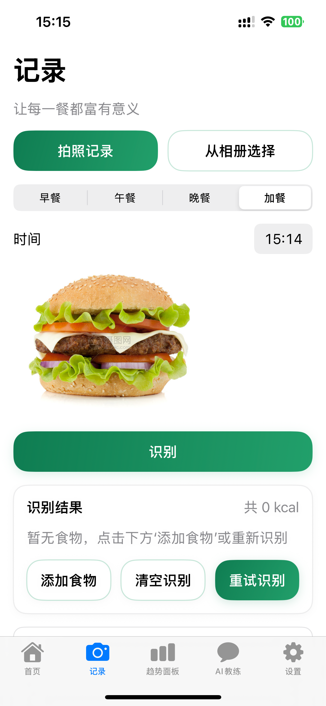
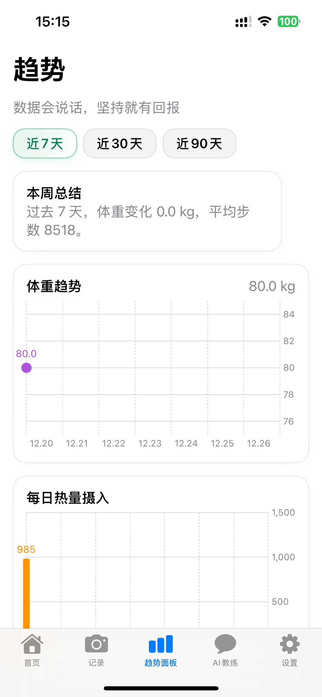
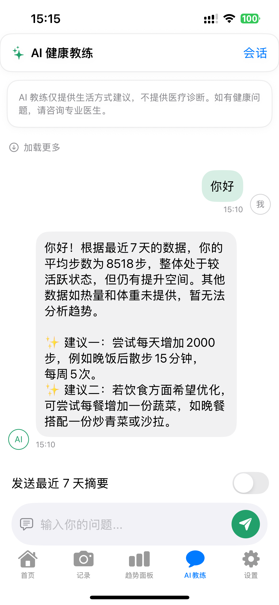
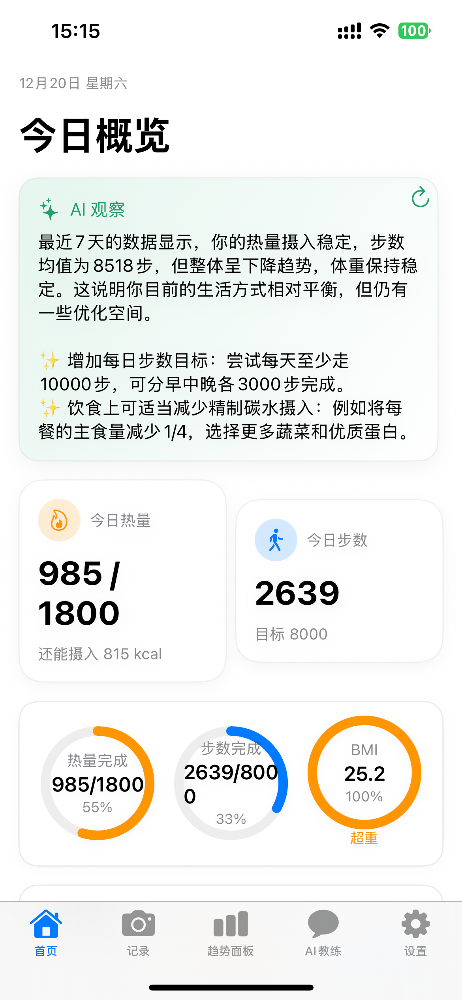
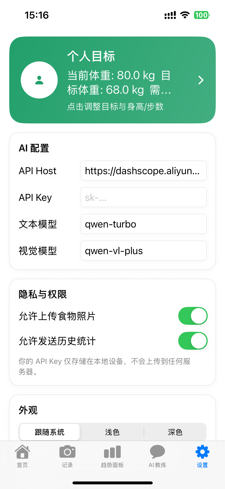

# 青柠健康 (Qingning Health)

SwiftUI 打造的 AI 健康助手，支持饮食识别、体重追踪、步数同步、AI 健康教练，并提供趋势分析与个性化设置。最低支持 **iOS 18.0**，依赖 SwiftUI + Core Data + HealthKit。

## 功能特性

### 🍽️ AI 饮食识别
拍照/相册识别食物，估算热量与三大宏量营养；支持手动编辑



### 📊 数据追踪  
体重记录、步数同步、热量统计与图表展示



### 🤖 AI 健康教练
对话获取建议，可附带近 7 天数据摘要



### 📈 趋势面板
体重、热量、步数的多周期趋势查看



### ⚙️ 设置与目标
AI 服务配置、步数/体重/热量目标、外观（跟随系统/浅色/深色）



## 技术栈
- 语言：Swift 5.9+
- UI：SwiftUI
- 数据：Core Data
- 健康：HealthKit（步数）
- 图表：Swift Charts
- 架构：MVVM + Repository

## 运行要求
- Xcode 15.0+
- iOS 18.0+（最低部署版本）

## 快速开始
1. 打开项目：`qinggan.xcodeproj`
2. 选择真机或模拟器（iOS 18+）
3. `Cmd+R` 运行

## AI 配置（推荐阿里千问兼容模式）
- 在 App 内 **设置 → AI 配置** 填写：
  - API Host: `https://dashscope.aliyuncs.com`
  - 文本模型: `qwen-turbo`
  - 视觉模型: `qwen-vl-plus`
  - 保存 API Key（仅存储本机 Keychain）
- 兼容模式接口：`/compatible-mode/v1/chat/completions`
- 若需终端快速验证，使用 `test_api.sh`（先替换脚本内的 API_KEY）。

## 主要目录
```
qinggan/
├── Core/          # 模型、协议、工具
├── Data/          # Repositories、服务、通知
├── Features/      # Home/Log/Dashboard/Chat/Body/Settings
├── UI/            # 组件与 SplashView
├── Assets.xcassets/AppIcon.appiconset # 应用图标
└── qingganApp.swift / AppRootView.swift
```

## 设计亮点
- 启动页：品牌渐变 + 脉动动效，文案“青柠健康”
- 主题：深色模式下增强边框对比（Card、按钮、Chip 等）
- 首页：概览卡片与营养胶囊网格对齐，信息密度清晰
- 记录页：识别结果列表使用 LazyVStack，长列表更流畅
- 设置页：顶部卡片可进入目标设置弹窗；外观切换即时生效

## 常见问题
- **AI 请求失败**：检查 Host、模型名与 API Key；终端用 `test_api.sh` 验证；路径需为 `/compatible-mode/v1/chat/completions`。

## 文档与资源索引

- **产品文档**：[data/产品说明文档.md](data/产品说明文档.md) - 核心价值、功能设计、技术实现思路、架构总览
- **演示视频**：[data/演示视频.mp4](data/演示视频.mp4) - 完整功能展示与交互演示

## 隐私与数据
- API Key 仅存储在本机 Keychain
- 健康数据读取仅用于步数统计与趋势展示，不上传

